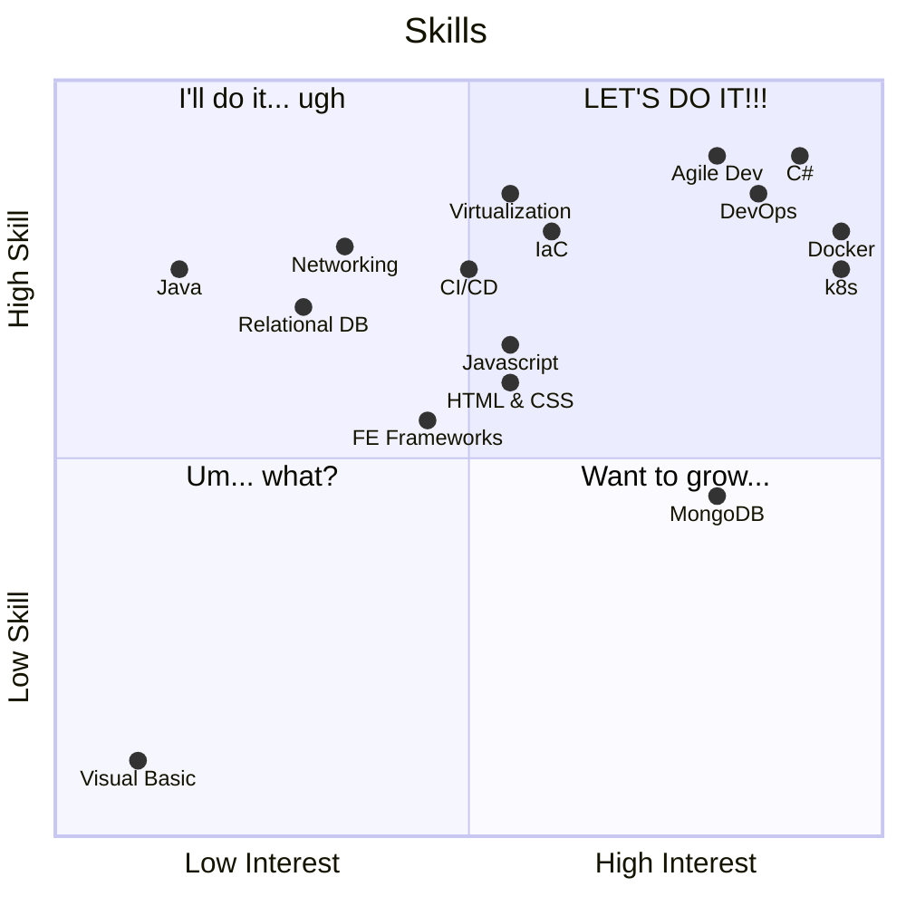

# IT Maestro and Innovation Alchemist🎺

With nearly three decades of triumphs in the ever-evolving landscape of computer engineering, I stand as a seasoned IT virtuoso. My expertise spans solution delivery, development prowess, and unwavering support, with a mastery that extends to large-scale consolidation endeavors, intricate data center choreography, and orchestrating cloud computing symphonies.

## A Symphony of Success🎵

I proudly boast a proven track record of conducting cross-functional teams and spearheading corporate development initiatives from the conceptual overture through the harmonious phases of design, implementation, and ongoing support. My forte includes a deep understanding of Agile methodologies and the rhythmic flow of CI/CD pipelines, with a resume that showcases the seamless integration of DevOps best practices.

## The Passionate Maestro🎼

Beyond the code and algorithms, my true passion lies in coaching and nurturing talent, a commitment aimed at propelling both individual stars and the collective brilliance of teams toward resounding success. In my quest for the next challenge, I am on the lookout for a dynamic role within a forward-thinking company—a stage where I can leverage my seasoned expertise to compose innovative solutions and compose the score for business growth.

## The Melody of Diverse Experience🎶

Having traversed the corridors of various industries, I bring forth a symphony of experiences and a treasure trove of knowledge. Consider me your adaptable troubadour, ready to leverage this extensive repertoire to ensure the success and harmony of your organization.

In my hands, technology becomes an art form, and every project transforms into a masterpiece. Let's collaborate to compose the future and create a legacy of innovation.

## ✨Fancy chart ✨

_these are only a few of the things I'm interested in and/or have experience with. I'm always looking to learn new things and expand my horizons. ask me about anything you don't see here, I may have experience with it or be interested in learning more about it._

## Hobbies🕹️

Skiing, Reading, 3D Printing, Electronics, Design and Manufacturing (CNC, Milling etc)

I stream to teach and tell stories on [Twitch](https://twitch.tv/thisisthevoice) and [YouTube](https://www.youtube.com/@thisistherealvoice)

## Languages🥖

* English (native)
* French (fluent)

## Employment History📝

### Senior Software Engineer, Segic, Brossard

#### *January 2023 — 2023*

* Responsible for the design and implementation of a new cloud-based SaaS platform.
* Helped migrate the existing monolith to a microservices architecture.
* Implemented a CI/CD pipeline to improve the delivery process.
* Implemented a new event-driven architecture to improve performance and scalability.
* Coached and mentored team members on the latest technology standards and best practices to ensure optimal delivery of projects.

### Chief Technology Officer, Leadfox, Sherbrooke

#### *2021 — December 2022*

* Played a key role in scaling the business by 10x through modernization of the technology stack.
* Led the transition from NodeJS to .NET C# microservices and implemented an event-driven architecture to optimize performance and scalability.
* Built and trained high-performing teams with the addition of highly skilled talent.
* Coached and mentored team members on the latest technology standards and best practices to ensure optimal delivery of projects.

### Director of Operations Tooling / senior engineer (SOFTWARE/DEVOPS), Acquisio (Web.com / Newfold), Brossard

#### *2010 — 2021*

* Built and nurtured a strong Professional Services team, resulting in improved client satisfaction and repeat business.
* Implemented the first complete ETL platform within the organization, streamlining data processing and improving efficiency.
* Started the first formal API division and standards committee, establishing best practices and enabling better collaboration across teams.
* Started the first internal Algorithms/ML/AI group, advancing the organization's capabilities in data-driven decision making.
* Built a complete usage-based SAS-enabled and pluggable billing system from the ground up, improving accuracy and transparency in billing processes.
* Created Dynamo, a small business online marketing enablement platform, to help drive growth and revenue for clients.
* Created and led Trading Desk Manager, a display/RTB campaign manager and sales tool for partners and direct SMBs, resulting in increased revenue and improved customer satisfaction.
* Designed and implemented an on-site Kubernetes (k8s) infrastructure, enabling better management of containerized applications.
* Planned and aided the migration of a core Java distributed monolith to k8s using git-triggered CI/CD, improving scalability and reducing downtime.

### Senior Systems Engineer/Architect, Aon GISS, Montréal

#### *2004 — 2009*

* Designed and developed solutions to ongoing business challenges, resulting in improved efficiency and productivity.
* Maintained critical infrastructure systems, ensuring optimal uptime and availability.
* Diagnosed application performance issues through measured tests and responses, working with project/team leads to develop a resolution path.
* Analyzed and tested products for potential application and performance enhancements, improving overall system performance.
* Planned and executed over 20 Netware to Windows server migrations, successfully transitioning critical systems to new platforms.
* Designed and implemented a HA/DRS VMWare ESX infrastructure, ensuring high availability and disaster recovery capabilities for critical applications.
* Developed, implemented, and tested multi-site DRS plans employing instant and fully automatic network and system recovery infrastructure for all critical applications and services, ensuring optimal resilience in the event of a disaster.
* Planned and executed server consolidation efforts that resulted in a reduction in complexity and cost while improving stability and performance of almost all systems and applications, saving the organization significant resources.
* Responsible for technology decisions and research, ensuring alignment with organizational goals and industry best practices.
* Responsible for reporting architecture analysis, providing key insights and recommendations to leadership.
* Responsible for server installs and patch management, ensuring optimal security and compliance.
* Other responsibilities include creating architectural blueprints, supporting internal clients, proof of concept, and creating and presenting roadmaps, demonstrating a well-rounded skillset.

### IT Security Specialist, Aon Consulting, Montréal

#### *2003 — 2004*

As an Information Security Specialist, I have extensive experience in evaluating and implementing security technology to protect critical systems and data. My responsibilities have included:

* Conducting regular vulnerability assessments of internal systems and coordinating remediation efforts with team leaders and business leads
* Maintaining information security processes and security control standards for application development and technology deployment
* Managing perimeter security and related access controls, including secure remote access solutions such as Client(less) VPN and Citrix/Terminal Services technologies
* Coordinating with application teams to develop secure application development processes
* Implementing hardware multi-factor authentication to enhance access controls
* Supporting internal clients and technicians with security-related issues
* Managing network systems such as routers and switches to ensure secure and reliable network connectivity.

### Network and Communications Specialist, Aon Consulting, Montréal

#### *1999 — 2003*

* Successfully managed network infrastructure equipment and implemented a highly redundant network infrastructure to ensure maximum uptime.
* Designed and implemented a secure core-site infrastructure to host 24/7 internet services and extranet partner networks.
* Implemented Simple Network Management Protocol (SNMP) on network devices for effective network management.
* Set up traffic filters using Standard and Extended access-lists, Distribute-Lists, and Route Maps to improve network security and performance.
* Developed and implemented a highly segmented VLAN infrastructure for granular network control, distribution, redundancy, and failover.
* Responsible for the end-to-end design and implementation of network infrastructure.
* Provided technical support to internal clients and technicians for all network-related issues.

## Career Highlights🔦

* Aided in building one of the most successful online marketing management and reporting tools used by agencies and businesses across the world.
* AON Data-center Move from 1801 McGill to 700 de la Gauchetiere Ouest (2006)
  * Was directly involved in physically moving 168 servers, 812 PCs, 227 printers and 752 phones over a period of 3 days, all without interruption of service. This significant undertaking was reported in the popular business magazine “Les Affaires” as being the largest physical IT move in Quebec that year.
* Implemented one of the first VMWare ESX farms crossing multiple Data-centers in Canada consisting of:
  * 48 HP Blade servers (mix of BL25p and BL460c series)
  * Over 200 VLANs and vDMZs
  * Hitachi v9570 and NetApp FAS3020 storage appliances
  * VMotion, DRS, HA, Virtual Center
* Planned and migrated 27 Novel Netware servers to Microsoft Windows used by over 3000 employees.
* Designed and Implemented the Canadian Active Directory services and migrated/merged 20 independent NT4 domains to form a single uniform authentication realm for all of Aon Canada.
